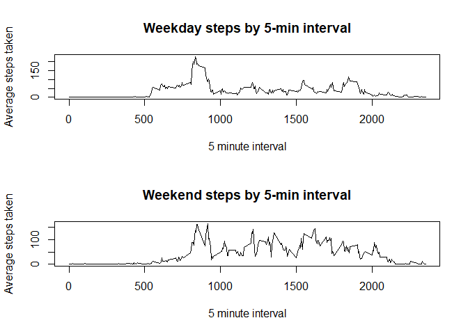

# Introduction
This report contains my submission for Course Project 1 of the Reproducible Research course. The project includes basic analysis of data from a personal activity monitoring device. All R code and corresponding figures are included in this report.

# Analysis

## Total number of steps per day

The first step in the analysis is to load the data into R and store it as a new variable, activity.


```r
activity <- read.csv("activity.csv") 
```
Now that the data is loaded, a total number of steps taken per day can be calculated.


```r
##calculate sums of steps by date
sums <- tapply(activity$steps,activity$date, FUN = sum, na.rm = TRUE)
##create new data frame including step sums by date
sumdf <- data.frame(date = names(sums), total.steps = sums)
```

Based on the total steps taken per day, a histogram can be created.


```r
hist(sumdf$total.steps, xlab = "Total steps taken per day", main = "Histogram of total steps taken per day")
```

<!-- -->

Additionally, a summary of the total number of steps taken per day can be created, which highlights both the mean and median of the data.


```r
summary(sumdf)
```

```
##          date     total.steps   
##  2012-10-01: 1   Min.   :    0  
##  2012-10-02: 1   1st Qu.: 6778  
##  2012-10-03: 1   Median :10395  
##  2012-10-04: 1   Mean   : 9354  
##  2012-10-05: 1   3rd Qu.:12811  
##  2012-10-06: 1   Max.   :21194  
##  (Other)   :55
```

One can see that the mean total steps taken per day is 10,395 steps, and the median is 9,354 steps.

## Daily activity pattern

Next, an analysis can be done on daily patterns, looking across all days at the average number of steps taken of each 5-minute interval in a day. In order to do this analysis, we can use the "interval" column in the activity data frame to calculate the averages by interval across all days.


```r
##calculate average number of steps by 5-minute interval
averages <- tapply(activity$steps, activity$interval, FUN = mean, na.rm = TRUE)
##create new data frame including step averages by interval
averagedf <- data.frame(interval = names(averages), average.steps = averages)
##add new column that changes format of interval so that they are ordered properly, by ensuring all have 4 digits
substr_int <- function(x, n){    substr(x, nchar(x)-n+1, nchar(x))}
library(dplyr)
```

```
## 
## Attaching package: 'dplyr'
```

```
## The following objects are masked from 'package:stats':
## 
##     filter, lag
```

```
## The following objects are masked from 'package:base':
## 
##     intersect, setdiff, setequal, union
```

```r
averagedf <- mutate(averagedf, interval2 = substr_int(paste0("0000", averagedf[,1]), 4))
```

Now that the averages are calculated, a time series plot of the average steps by 5-minute interval across all days can be created.


```r
## create timeseries plot of average number of steps taken across all days by 5-minute interval
plot(averagedf$interval2, averagedf$average.steps, type = "l", xlab = "5 minute interval", ylab = "Average steps taken", main = "Steps taken by 5- minute interval, across days")
```

<!-- -->

The plot shows that a high point in number of steps per day occurs between 5:00am and 10:00am. The exact interval with the highest average steps per day can be calculated as follows:


```r
## extract and display the row from the averages dataframe that contains the max average number of steps in a given interval
max_int <- averagedf[which.max(averagedf$average.steps),]
max_int
```

```
##     interval average.steps interval2
## 104      835      206.1698      0835
```

One can see that the maximum in average steps taken in an interval occurs in the "835" interval, which corresponds to 8:35AM, where the average steps across days during that interval is 206.2 steps.

## Missing value analysis

The next step is to calculate the total number of missing values in the original dataset.


```r
## calculate missing values in activity dataset
missing <- sum(is.na(activity$steps))
missing
```

```
## [1] 2304
```

One can see that the total number of missing values is 2,304. Now, we can apply a strategy to replace these missing values. I have chosen to replace the values with the mean of the given 5-minute interval where a value is missing.


```r
library(plyr)
```

```
## ------------------------------------------------------------------------------
```

```
## You have loaded plyr after dplyr - this is likely to cause problems.
## If you need functions from both plyr and dplyr, please load plyr first, then dplyr:
## library(plyr); library(dplyr)
```

```
## ------------------------------------------------------------------------------
```

```
## 
## Attaching package: 'plyr'
```

```
## The following objects are masked from 'package:dplyr':
## 
##     arrange, count, desc, failwith, id, mutate, rename, summarise,
##     summarize
```

```r
## create a function to replace NA values with the mean of a given group
impute.mean <- function(x) replace(x, is.na(x), mean(x, na.rm = TRUE))
## create a new dataframe that applies the mean replacement function by 5-minute interval
activity2 <- ddply(activity, ~ interval, transform, steps = impute.mean(steps))
```

Now that the missing values have been replaced in a new dataframe, we can calculate sums by date on this new data set.


```r
##calculate sums of steps by date
sums2 <- tapply(activity2$steps,activity2$date, FUN = sum, na.rm = TRUE)
##create new data frame including step sums by date
sumdf2 <- data.frame(date = names(sums2), total.steps = sums2)
```

These new sum values can now be used to create a histogram based on the new dataframe.


```r
hist(sumdf2$total.steps, xlab = "Total steps taken per day", main = "Histogram of total steps taken per day with NA values replaced")
```

<!-- -->

Similarly, a new summary can be created, highlighting the mean and median of the new dataframe.


```r
summary(sumdf2)
```

```
##          date     total.steps   
##  2012-10-01: 1   Min.   :   41  
##  2012-10-02: 1   1st Qu.: 9819  
##  2012-10-03: 1   Median :10766  
##  2012-10-04: 1   Mean   :10766  
##  2012-10-05: 1   3rd Qu.:12811  
##  2012-10-06: 1   Max.   :21194  
##  (Other)   :55
```

One can see that the new mean total steps taken per day is 10,766 steps, and the new median is 10,766 steps. Since we added in averages by 5-minute interval, the median is quite similar, but the mean is higher than it was when missing values were simply removed. 

## Weekday and Weekend Analysis

A new factor variable can be created to note whether a given date is a weekday or weekend; this variable can be added as a new column to the dataframe with values imputed for the NA entries.


```r
## change date column format to date
activity2$date <- as.Date(activity2$date)
## add column to dataframe that lists day of week
activity3 <- mutate(activity2, weekday = weekdays(activity2$date))
## add column to dataframe that lists whether day is weekday or weekend
activity4 <- activity3 %>%
 mutate(day.type = case_when(
 weekday == "Monday"~"weekday",
 weekday == "Tuesday"~"weekday",
 weekday == "Wednesday"~"weekday",
 weekday == "Thursday"~"weekday",
 weekday == "Friday"~"weekday",
 weekday == "Saturday"~"weekend",
 weekday == "Sunday"~"weekend",
))
```

Once this variable is created and stored in a new column, the dataframe can be split to separate the weekday and weekend data into two separate dataframes.


```r
weekday <- activity4[activity4$day.type == "weekday",]
weekend <- activity4[activity4$day.type == "weekend",]
```

Now, for both the weekday and weekend dataframes, average number of steps by 5-minute interval can be calculated and stored, and new dataframes can be created to store the averages data.


```r
##calculate average number of steps by 5-minute interval for both weekend and weekday data sets
dayave <- tapply(weekday$steps, weekday$interval, FUN = mean, na.rm = TRUE)
endave <- tapply(weekend$steps, weekend$interval, FUN = mean, na.rm = TRUE)
##create new data frames including step averages by interval for weekday and weekend data sets
weekdaydf <- data.frame(interval = names(dayave), average.steps = dayave)
weekenddf <- data.frame(interval = names(endave), average.steps = endave)
##add new column to each new dataframe that changes format of interval so that they are ordered properly, by ensuring all have 4 digits
weekdaydf <- mutate(weekdaydf, interval2 = substr_int(paste0("0000", weekdaydf[,1]), 4))
weekenddf <- mutate(weekenddf, interval2 = substr_int(paste0("0000", weekenddf[,1]), 4))
##add "weekday" and "weekend" column into summary dataframes
weekdaydf <- mutate(weekdaydf, day.type = "weekday")
weekenddf <- mutate(weekenddf, day.type = "weekend")
```

Finally, the average number of steps by 5-minute interval can be plotted to compare the weekday and weekend data.

```r
## create two panels for plotting panel 
par(mfrow = c(2,1))
## create two plots to show number of steps by 5-minute interval for both weekdays and weekends
plot(weekdaydf$interval2, weekdaydf$average.steps, type = "l", xlab = "5 minute interval", ylab = "Average steps taken", main = "Weekday steps by 5-min interval")
plot(weekenddf$interval2, weekenddf$average.steps, type = "l", xlab = "5 minute interval", ylab = "Average steps taken", main = "Weekend steps by 5-min interval")
```

<!-- -->

One can see that in general, the weekday steps peak earlier in the day.

This concludes the step analysis.
